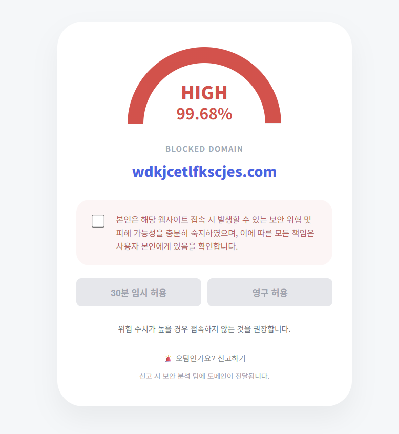
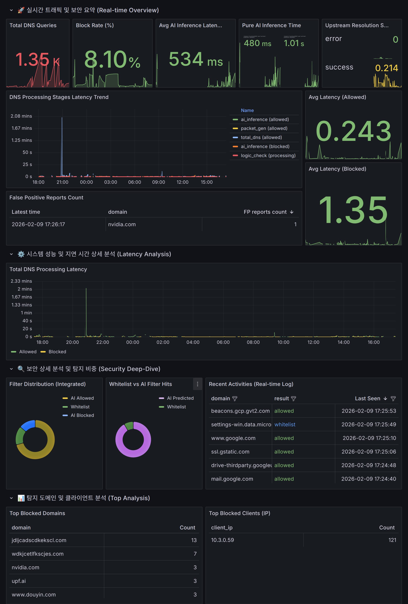

# 🛡️ SURF
> **AI 기반 실시간 도메인 추론 및 지능형 DNS 차단 솔루션**

---

## 1. Summary
**SURF**는 기존의 정적 블랙리스트 기반 차단 방식에서 벗어나, **딥러닝 모델이 도메인 주소(URL)를 실시간으로 분석**하고 악성 여부를 판단하는 차세대 보안 DNS 서비스입니다. Unbound DNS 서버에 파이썬 모듈을 직접 통합하여, 모든 질의에 대해 지능적인 필터링과 실시간 모니터링 대시보드를 제공합니다.

## 2. 문제 정의 (Problem Definition)
* **정적 리스트의 한계**: 매일 수십만 개씩 생성되는 신규(Zero-day) 악성 도메인을 기존 블랙리스트 방식으로는 선제 방어하기 어렵습니다.
* **DNS 캐시 우회 취약점**: 공유 DNS 환경에서 타 사용자의 접속 이력이 Cache에 남아있을 경우, 보안 모듈이 실행되지 않고 악성 사이트에 접속되는 보안 위험이 발생합니다.
* **불친절한 사용자 경험**: 차단 발생 시 브라우저에서 단순 에러 메시지만 노출되어, 사용자가 정확한 위협 상황을 인지하지 못합니다.

## 3. 제안 솔루션 개요 (Solution Overview)
본 프로젝트는 **DNS Layer에서의 직접적인 AI 추론**을 제안합니다. DNS 질의 단계에서 도메인의 패턴을 모델이 즉시 분석하고, Redis와 Flask를 매개체로 브라우저 익스텐션과 실시간 데이터를 동기화하여 시각적인 가이드와 차단 페이지를 제공합니다.

## 4. 주요 기능 정의 (Key Features)
* **Real-time AI Inference**: Unbound Python 모듈을 통해 질의된 도메인의 악성 확률을 0.15초 이내에 추론합니다.
* **Shared Cache Lockdown**: 캐시 우회 차단 및 사용자별 독립적 보안 정책 적용합니다.
* **Dual-Stack NXDOMAIN**: IPv4(A)와 IPv6(AAAA) 레코드를 동시 처리하여 완벽한 접속 차단 구현합니다.
* **Interactive Block Page**: 차단된 사이트의 위험도 시각화 및 사용자 '임시 허용' 요청 기능합니다.

## 5. 데이터 및 기술 활용 (Data & Tech)

### **AI Model: Hybrid Feature Fusion Network**
본 프로젝트의 핵심인 도메인 분류 모델은 도메인 이름의 언어적 특성과 구조적 패턴을 동시에 파악하기 위해 **Dual-modal Pre-training & Fine-tuning** 구조로 설계되었습니다.

* **Feature 1: Char-level Representation**
    * 도메인 구성 문자의 순서와 조합을 분석하여 DGA(Domain Generation Algorithm)와 같은 무작위 패턴을 탐지합니다.
* **Feature 2: Subword-level Representation**
    * 도메인 내 의미 있는 단어 단위(subword)를 추출하여 피싱 도메인에서 자주 사용되는 키워드 패턴을 학습합니다.
* **Training Strategy**:
    1.  **Dual Pre-training**: Char와 Subword 각각의 특징을 독립적인 인코더로 사전 학습하여 고유의 특성을 추출합니다.
    2.  **Multi-modal Fusion**: 사전 학습된 두 인코더의 출력 벡터를 Concatenation하는 계층을 구성합니다.
    3.  **End-to-End Fine-tuning**: 결합된 모델을 악성/정상 도메인 데이터셋으로 최종 파인튜닝하여 판별 성능을 극대화했습니다.

### **Technical Stack**
* **DNS Engine**: `Unbound` (Custom Python Module integration)
* **AI Core**: `PyTorch` (Custom Hybrid Model)
* **Data Bridge**: `Redis` (Block Status & TTL Management), `Flask` (REST API)
* **Monitoring**: `Prometheus` & `Grafana` (Dashboard)
* **Interface**: `Chrome Extension` (Manifest V3, JavaScript)

### **Data Flow**
1. **Unbound**: 질의 수신 후 Python 모듈로 도메인 문자열 전달.
2. **AI Model**: 도메인 패턴 분석 및 악성 유무 판별.
3. **Redis**: 클라이언트 IP와 도메인을 매핑하여 차단 기록 및 타임스탬프 저장.
4. **Extension**: 브라우저 에러 감지 시 Flask API를 통해 Redis 상태 확인 후 전용 차단 페이지 로드.

## 6. 사용자 시나리오/유즈케이스 (User Scenario)
1. **위협 탐지**: 사용자가 악성 도메인 접속 시도 시 DNS 서버가 쿼리를 가로채 AI 추론을 수행합니다.
2. **실시간 기록**: 판별 결과는 즉시 **관리자 대시보드**에 업데이트되어 전체 네트워크 위협 수준을 표시합니다.
3. **사용자 경고**: 브라우저 익스텐션이 화면을 전환하여 위험도 수치가 포함된 보안 경고 페이지를 노출합니다.
4. **대응 및 분석**: 관리자는 대시보드에서 차단 로그를 분석하고, 사용자는 필요한 경우 임시 허용을 요청합니다.

## 7. 기대 효과 및 향후 확장성 (Expected Impact)
* **기대 효과**: 신종 위협에 대한 선제적 방어 체계 구축 및 네트워크 계층에서의 통합 보안 강화.
* **향후 확장성**: 
    * **DoH(DNS over HTTPS) 지원**: 질의 자체의 암호화를 통한 데이터 무결성 확보.
    * **멀티모달 추론**: 도메인 명뿐만 아니라 사이트 메타데이터를 결합한 고도화된 모델 적용.

---
## 🖼 실행 화면
| 차단 안내 페이지 (Extension) | 통합 모니터링 대시보드 |
| :---: | :---: |
|  |  |
